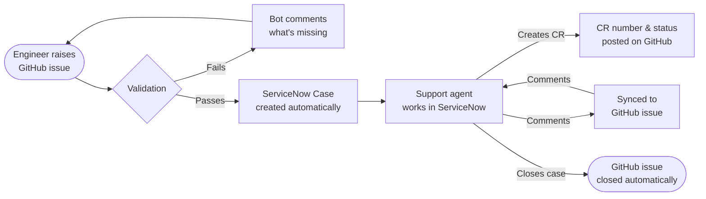

# GitHub ↔ ServiceNow Integration

Raise a GitHub issue → a ServiceNow Case is created automatically. Change Requests, assignments, closures, and comments all sync back to GitHub. No one needs to touch ServiceNow manually.

## How it works

## Issue Templates

| Template | When to use |
|---|---|
| **Bug Report / Incident** | Reporting a bug or system incident |
| **Service Request – Generic** | General service or information request |
| **Normal Change Generic** | Planned change with full implementation details |

Blank issues are disabled. Labels are applied automatically on submission.

## What syncs automatically

- **Case creation** — on every validated issue
- **Case updates** — issue edits are sent to ServiceNow (until a CR exists)
- **Comment sync** — bidirectional, GitHub ↔ ServiceNow in real time
- **Change Request notifications** — CR number, state, and schedule posted on the issue
- **Case closure** — closes the GitHub issue automatically
- **Case assignment** — posts an assignment comment on the issue

## Secrets required

Set in **Repository Settings → Secrets and variables → Actions**:

| Secret | Value |
|---|---|
| `SERVICENOW_URL` | `https://<instance>.service-now.com/api/<scope>/gh_integration/case` |
| `SERVICENOW_UI_URL` | `https://<instance>.service-now.com` |
| `SERVICENOW_USERNAME` | ServiceNow user with REST API access |
| `SERVICENOW_PASSWORD` | Password for the above user |

## Setup

See [INSTALLATION.md](INSTALLATION.md) for the full GitHub and ServiceNow configuration guide.
